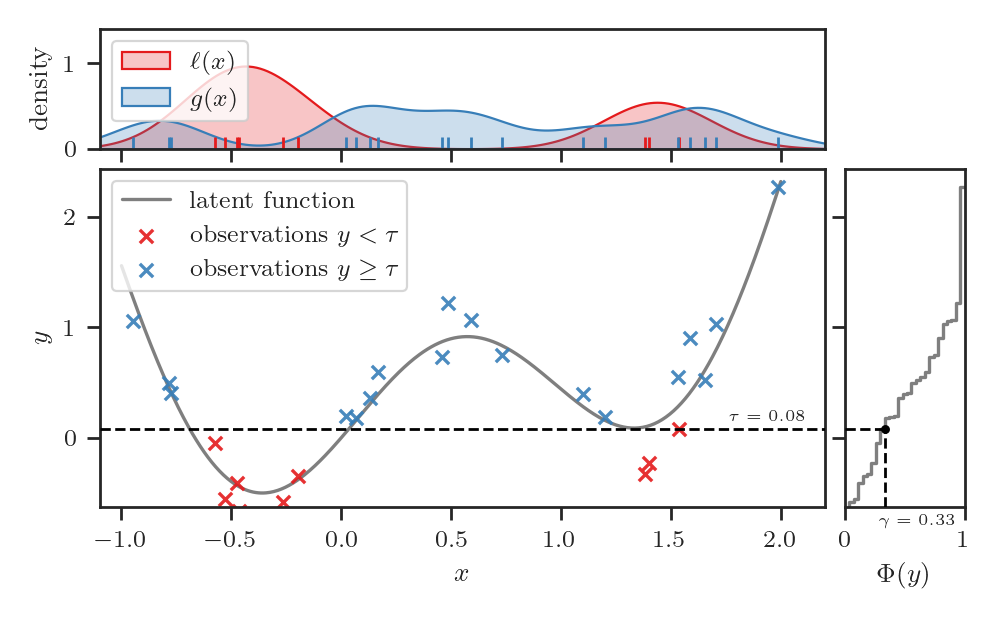

=======================================================
BORE: Bayesian Optimization as Density-Ratio Estimation
=======================================================

.. image:: https://img.shields.io/pypi/v/bore.svg
        :target: https://pypi.python.org/pypi/bore

.. image:: https://img.shields.io/travis/ltiao/bore.svg
        :target: https://travis-ci.org/ltiao/bore

.. image:: https://readthedocs.org/projects/bore/badge/?version=latest
        :target: https://bore.readthedocs.io/en/latest/?badge=latest
        :alt: Documentation Status

.. image:: https://pyup.io/repos/github/ltiao/bore/shield.svg
     :target: https://pyup.io/repos/github/ltiao/bore/
     :alt: Updates

A minimalistic implementation of BORE: Bayesian Optimization as Density-Ratio Estimation [1]_
in Python 3 and TensorFlow 2.

|featured|

Getting Started
---------------

Install with ``pip``:

.. code-block:: bash

  $ pip install "bore[tf]"

With support for GPU accelaration:

.. code-block:: bash

  $ pip install "bore[tf-gpu]"

With support for HpBandSter plugin: 

.. code-block:: bash

  $ pip install "bore[tf,hpbandster]"

Usage/Examples
--------------

This example implements an instantiation of BORE based on a multi-layer perceptron (i.e. a fully-connected feed-forward neural network) classifier. 

First we build and compile the classifier model using ``MaximizableSequential``:

.. code-block:: python

  from bore.models import MaximizableSequential
  from tensorflow.keras.layers import Dense

  # build model
  classifier = MaximizableSequential()
  classifier.add(Dense(16, activation="relu"))
  classifier.add(Dense(16, activation="relu"))
  classifier.add(Dense(1, activation="sigmoid"))

  # compile model
  classifier.compile(optimizer="adam", loss="binary_crossentropy")

This syntax should be familiar to anyone who has used a high-level neural network library such as Keras. In fact, ``MaximizableSequential`` is simply a subclass of the ``Sequential`` class from Keras. More specifically, in addition to inheriting the usual functionalities, it provides the ``argmax`` method which finds the input at which the network output is maximized. 

Using this method, the standard optimization loop can be implemented as follows:

.. code-block:: python

  import numpy as np

  features = []
  targets = []

  # initial design
  features.extend(features_init)
  targets.extend(targets_init)

  for i in range(num_iterations):

      # construct classification problem
      X = np.vstack(features)
      y = np.hstack(targets)

      tau = np.quantile(y, q=0.25)
      z = np.less(y, tau)

      # update classifier
      classifier.fit(X, z, epochs=200, batch_size=64)

      # suggest new candidate
      x_next = classifier.argmax(method="L-BFGS-B", num_start_points=3, bounds=bounds)

      # evaluate blackbox function
      y_next = blackbox.evaluate(x_next)

      # update dataset
      features.append(x_next)
      targets.append(y_next)

Features
--------

* BORE-MLP: BORE based on a multi-layer perceptron (MLP) classifier

  * Provides higher-order functions that leverage automatic differentiation to transform Keras models into functions that can easily be optimized by methods in SciPy, not least multi-started quasi-Newton hill-climbing methods such as L-BFGS.  

Roadmap
-------

* Integration with the `Optuna <https://optuna.org/>`_ framework by implementing a `Sampler <https://optuna.readthedocs.io/en/stable/reference/generated/optuna.samplers.BaseSampler.html#optuna.samplers.BaseSampler>`_ plugin.

Authors
-------

Lead Developers:
++++++++++++++++

+------------------+----------------------------+
| |tiao|           | |klein|                    |
+------------------+----------------------------+
| Louis Tiao       | Aaron Klein                |
+------------------+----------------------------+
| https://tiao.io/ | https://aaronkl.github.io/ |
+------------------+----------------------------+

Reference
---------

.. [1] L. Tiao, A. Klein, C. Archambeau, E. V. Bonilla, M. Seeger, and F. Ramos. 
  `BORE: Bayesian Optimization by Density-Ratio Estimation <https://arxiv.org/abs/2102.09009>`_. 
  In Proceedings of the 38th International Conference on Machine Learning (ICML2021), 
  Virtual (Online), July 2021.

Cite:
+++++

.. code-block::

  @inproceedings{tiao2021-bore,
    title={{B}ayesian {O}ptimization by {D}ensity-{R}atio {E}stimation},
    author={Tiao, Louis and Klein, Aaron and Archambeau, C\'{e}dric and Bonilla, Edwin V and Seeger, Matthias and Ramos, Fabio},
    booktitle={Proceedings of the 38th International Conference on Machine Learning (ICML2021)},
    address={Virtual (Online)},
    year={2021},
    month={July}
  }

License
-------

MIT License

Copyright (c) 2021, Louis C. Tiao

Permission is hereby granted, free of charge, to any person obtaining a copy
of this software and associated documentation files (the "Software"), to deal
in the Software without restriction, including without limitation the rights
to use, copy, modify, merge, publish, distribute, sublicense, and/or sell
copies of the Software, and to permit persons to whom the Software is
furnished to do so, subject to the following conditions:

The above copyright notice and this permission notice shall be included in all
copies or substantial portions of the Software.

THE SOFTWARE IS PROVIDED "AS IS", WITHOUT WARRANTY OF ANY KIND, EXPRESS OR
IMPLIED, INCLUDING BUT NOT LIMITED TO THE WARRANTIES OF MERCHANTABILITY,
FITNESS FOR A PARTICULAR PURPOSE AND NONINFRINGEMENT. IN NO EVENT SHALL THE
AUTHORS OR COPYRIGHT HOLDERS BE LIABLE FOR ANY CLAIM, DAMAGES OR OTHER
LIABILITY, WHETHER IN AN ACTION OF CONTRACT, TORT OR OTHERWISE, ARISING FROM,
OUT OF OR IN CONNECTION WITH THE SOFTWARE OR THE USE OR OTHER DEALINGS IN THE
SOFTWARE.

.. |tiao| image:: http://gravatar.com/avatar/d8b59298191057fa164edf80f0743fcc?s=120
   :align: middle
.. |klein| image:: https://via.placeholder.com/120
   :align: middle

